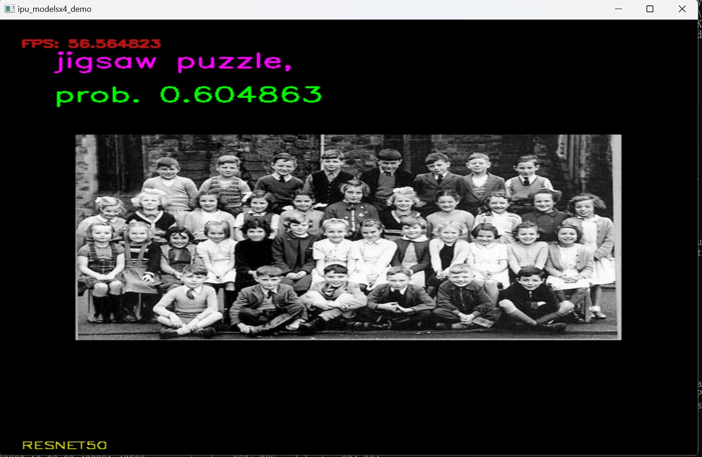
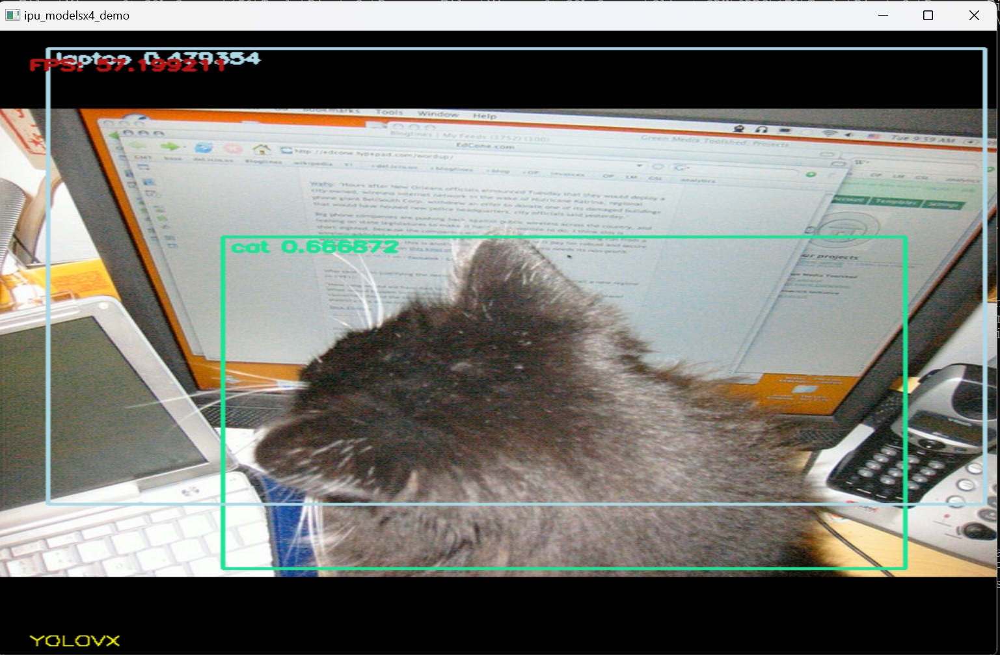

<table style="width:100%">
  <tr>

<th width="100%" colspan="6"><h1>Multi Model Exec</h1>

</tr>

</table>


## Table of Contents

- [1 Introduction](#1-Introduction)
- [2 Design Files](#2-Design-Files)
- [3 Demo Setup](#3-Demo-Setup)
    - [3.1 Environment Setup](#31-Environment-Setup)
    - [3.2 Demo Preparation](#32-Demo-Preparation)
- [4 Run The Demo](#4-Run-The-Demo)
- [5 Know Issues](#5-Know-Issues)

## 1 Introduction

This is the demo of showing multiple AI models running concurrently on Ryzen AI. Please note that all the steps mentioned here need to be performed in ***Windows CMD Prompt***, if you perform this demo in ***Windows Powershell***, some errors will occur. The following models are used:
- MobileNet_v2
- ResNet50
- Retinaface
- Segmentation
- Yolox

------

## 2 Design Files
<a name="2-Design-Files"></a>


```
│  README.md
│
├─bin
│      npu_multi_models.exe
│      onnxruntime.dll
│      onnxruntime_providers_shared.dll
│      onnxruntime_providers_vitisai.dll
│      onnxruntime_vitisai_ep.dll
│      DirectML.dll
│      vaip_config.json
│
├─images
│      mobilenet_V2.jpg
│      modelsx4.jpg
│      resnet50.jpg
│      retina.jpg
│      segmentation.jpg
│      yolox.jpg
│
└─npu_modelsx4_demo
    │  run_mobile_net_v2.bat
    │  run_modelx4.bat
    │  run_modelx4_with_camera_on.bat
    │  run_resnet50.bat
    │  run_retinaface.bat
    │  run_segmentation.bat
    │  run_yolovx.bat
    │
    └─config
            mobile_net_v2.json
            modelx4.json
            modelx4_with_camera_on.json
            resnet50.json
            retinaface.json
            segmentation.json
            yolovx.json
```

## 3 Demo Setup

### 3.1 Environment Setup 

Please note that all the steps mentioned here need to be performed in ***Windows CMD Prompt***. Make sure the NPU driver has been installed by following the instructions on the [Ryzen AI Developer Guide](https://ryzenai.docs.amd.com/en/latest). The NPU driver version = 32.0.201.204 has been tested. The older version might work but no guaranteed. 

1. Follow these steps to install Anaconda on your system if it has not been installed:

- **Download Anaconda:** Visit the Anaconda download page (https://www.anaconda.com/products/distribution) and choose the distribution that matches your operating system (Windows, macOS, or Linux). Download the Python 3.9 version.

- **Install Anaconda:** Follow the installation instructions for your operating system. Generally, this involves running the installer and accepting the default settings.

- **Verify Installation:** After installation, open Anaconda Prompt on Windows and type `conda --version` to verify that Anaconda was installed correctly. You should see the installed Conda version.

2. Install Ryzen AI by following the [documentation](https://ryzenai.docs.amd.com/en/latest/inst.html#) 

3. Activate the Environment
    ```bash
    conda activate <env_name>
    ```
### 3.2 Demo Preparation

Download the onnx models and test image/video package, and unzip it under **<path_to_RyzenAI-SW>/demo/multi-model-exec/ipu_modelsx4_demo/**. 


    [Download Package](https://www.xilinx.com/bin/public/openDownload?filename=resource_multi_model_demo.zip)

 You should have the directory like this: 
 ```bash
.
├── ***.bat
├── config
├── resource
│   ├── RetinaFace_int.onnx
│   ├── detection
│   ├── detection.avi
│   ├── face
│   ├── face.avi
│   ├── mobilenetv2_1.4_int.onnx
│   ├── nano-YOLOX_int.onnx
│   ├── pointpainting-nus-FPN_int.onnx
│   ├── resnet50_pt.onnx
│   ├── seg_512_288.avi
│   └── to_video.py
```


## 4 Run The Demo

Please note that all the steps mentioned here need to be performed in ***Windows CMD Prompt***. You can load and run the models one by one: 
run_mobile_net_v2.bat


run_resnet50.bat

run_retinaface.bat

run_segmentation.bat


run_yolovx.bat


or you can load and run multiple models at the same time: 

run_modelx4.bat


## 5 Know Issues

- Python version version 3.10 is required if not "The code execution cannot proceed because python39.dll was not found. Reinstalling he programm may fix this problem"
- If you find an exclamation mark on the icon of the AMD NPU device in the System Devices list in your Device Manager, it indicates that there is an issue with your driver installation, and the program may not function correctly.
- If this demo aborted with the 'glog.dll cannot be found' error, you need to use the command 'set PATH=C:<path-to-conda-glog>;%PATH%' to explicitly export the path to 'glog.dll'. 'glog.dll' is installed along with ANACONDA3. The recommended ANACONDA3 installer is 'Anaconda3-2023.07-2-Windows-x86_64'.
