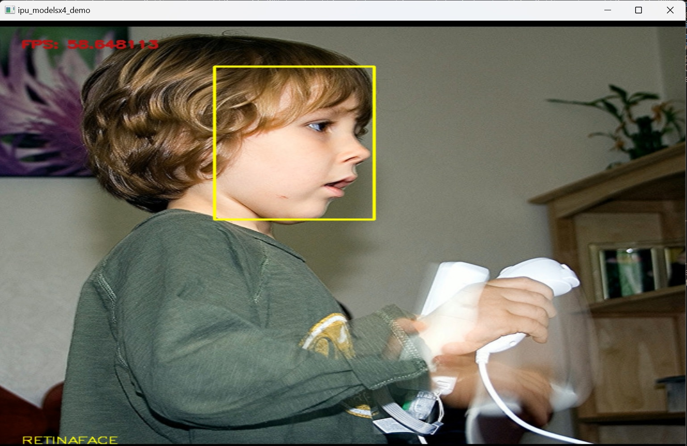

<table style="width:100%">
  <tr>

<th width="100%" colspan="6"><h1>Multi Model Exec</h1>

</tr>

</table>


## Table of Contents

- [1 Introduction](#1-Introduction)
- [2 Design Files](#2-Design-Files)
- [3 Demo Setup](#3-Demo-Setup)
- [4 Run The Demo](#4-Run-The-Demo)
- [5 Know Issues](#5-Know-Issues)

## 1 Introduction

This is the demo of showing multiple AI models running concurrently on Ryzen AI. Please note that all the steps mentioned here need to be performed in ***Windows CMD Prompt***, if you perform this demo in ***Windows Powershell***, some errors will occur. The following models are used:
- MobileNet_v2
- ResNet50
- Retinaface
- Segmentation
- Yolox

------

## 2 Design Files
<a name="2-Design-Files"></a>


```
│  README.md
│
├─bin
│      npu_multi_models.exe
│      onnxruntime.dll
│      onnxruntime_providers_shared.dll
│      onnxruntime_providers_vitisai.dll
│      onnxruntime_vitisai_ep.dll
│      DirectML.dll
│      vaip_config.json
│
├─images
│      mobilenet_V2.jpg
│      modelsx4.jpg
│      resnet50.jpg
│      retina.jpg
│      segmentation.jpg
│      yolox.jpg
│
└─npu_modelsx4_demo
    │  run_mobile_net_v2.bat
    │  run_modelx4.bat
    │  run_modelx4_with_camera_on.bat
    │  run_resnet50.bat
    │  run_retinaface.bat
    │  run_segmentation.bat
    │  run_yolovx.bat
    │
    └─config
            mobile_net_v2.json
            modelx4.json
            modelx4_with_camera_on.json
            resnet50.json
            retinaface.json
            segmentation.json
            yolovx.json
```

## 3 Demo Setup

Make sure you have met all the requirements by following the [Installation Instructions](https://ryzenai.docs.amd.com/en/latest/inst.html#).

For step-by-step procedure for installing dependencies and building the demo from the source code following the [Multi Model instructions](../../example/multi-model/README.md)

Download the onnx models and test image/video package, and unzip it under **<path_to_RyzenAI-SW>/demo/multi-model-exec/npu_modelsx4_demo/**


  [Download Resource Package](https://www.xilinx.com/bin/public/openDownload?filename=resource_multi_model_demo.zip)

 You should have the directory like this: 
 ```bash
├── bin
│   ├── DirectML.dll
│   ├── npu_multi_models.exe
│   ├── onnxruntime.dll
│   ├── onnxruntime_providers_shared.dll
│   ├── onnxruntime_providers_vitisai.dll
│   ├── onnxruntime_vitisai_ep.dll
│   └── vaip_config.json
├── images
│   ├── mobilenet_V2.jpg
│   ├── modelsx4.jpg
│   ├── resnet50.jpg
│   ├── retina.jpg
│   ├── segmentation.jpg
│   └── yolox.jpg
├── npu_modelsx4_demo
│   ├── config
│   │   ├── mobile_net_v2.json
│   │   ├── modelx4.json
│   │   ├── modelx4_with_camera_on.json
│   │   ├── resnet50.json
│   │   ├── retinaface.json
│   │   ├── segmentation.json
│   │   └── yolovx.json
│   ├── resource
│   │   ├── detection
│   │   ├── face
│   │   ├── mobilenetv2_1.4_int.onnx
│   │   ├── nano-YOLOX_int.onnx
│   │   ├── pointpainting-nus-FPN_int.onnx
│   │   ├── resnet50_pt.onnx
│   │   ├── RetinaFace_int.onnx
│   │   └── seg_512_288.avi
│   ├── run_mobile_net_v2.bat
│   ├── run_modelx4.bat
│   ├── run_modelx4_with_camera_on.bat
│   ├── run_resnet50.bat
│   ├── run_retinaface.bat
│   ├── run_segmentation.bat
│   └── run_yolovx.bat
└── README.md

```


## 4 Run The Demo

Please note that all the steps mentioned here need to be performed in ***Windows CMD Prompt***. You can load and run the models one by one: 

Run the MobileNet V2 based classification model:

```bash
cd npu_modelsx4_demo
run_mobile_net_v2.bat
```


Run the ResNet50 based classification model:

```bash
run_resnet50.bat
```


Run the RetinaFace model for face detection:

```bash
run_retinaface.bat
```



Run the segmentation model:

```bash
run_segmentation.bat
```


Run the YOLO based object detection model:

```bash
run_yolovx.bat
```


or you can load and run multiple models at the same time:

```bash
run_modelx4.bat
```


## 5 Know Issues

- Python version version 3.10 is required if not "The code execution cannot proceed because python39.dll was not found. Reinstalling he programm may fix this problem"
- If you find an exclamation mark on the icon of the AMD NPU device in the System Devices list in your Device Manager, it indicates that there is an issue with your driver installation, and the program may not function correctly.
- If this demo aborted with the 'glog.dll cannot be found' error, you need to use the command 'set PATH=C:<path-to-conda-glog>;%PATH%' to explicitly export the path to 'glog.dll'. 'glog.dll' is installed along with ANACONDA3. The recommended ANACONDA3 installer is 'Anaconda3-2023.07-2-Windows-x86_64'.
