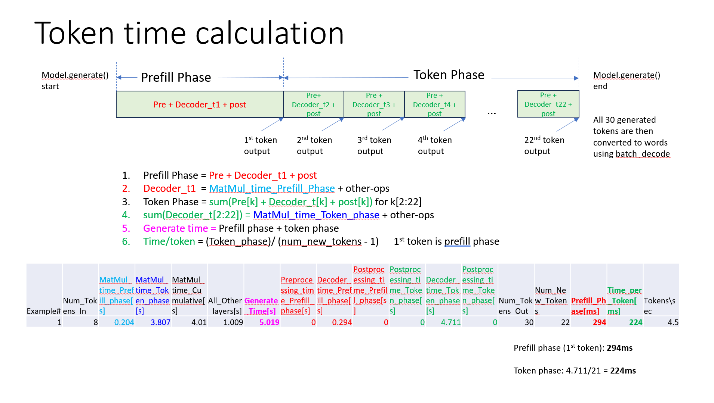

# LLMs on RyzenAI with Pytorch

## Models supported with Pytorch flow

The following models are supported on RyzenAI with the 4 quantization recipes described in here.

| Model Name                   | SmoothQuant |   AWQ   | AWQPlus | PerGroup | Quant Model Size
|------------------------------|-------------|---------|---------|----------|-----------------
| facebook/opt-125m            | &check;     | &check; | &check; | &check;  | 0.07
| facebook/opt-1.3b            | &check;     | &check; | &check; | &check;  | 0.8
| facebook/opt-2.7b            | &check;     | &check; | &check; | &check;  | 1.4
| facebook/opt-6.7b            | &check;     | &check; | &check; | &check;  | 3.8
| facebook/opt-13b             |             | &check; | &check; | &check;  | 7.5
| llama-2-7b*                  | &check;     |         |         | &check;  | 3.9
| llama-2-7b-chat*             | &check;     | &check; | &check; | &check;  | 3.9
| llama-2-13b*                 |             |         |         | &check;  | 7.2
| llama-2-13b-chat*            |             | &check; | &check; | &check;  | 7.2
| Meta-Llama-3-8B-Instruct  *  |             |         |         | &check;  | 4.8
| bigcode/starcoder            |             | &check; | &check; | &check;  | 8.0
| code-llama-2-7b*             |             | &check; | &check; | &check;  | 3.9
| codellama/CodeLlama-7b-hf    |             | &check; | &check; | &check;  | 3.9
| codellama/CodeLlama-7b-instruct-hf     |             | &check; | &check; | &check;  | 3.9
| google/gemma-2b  **          |             | &check; | &check; | &check;  | 1.2
| google/gemma-7b  **          |             | &check; | &check; | &check;  | 4.0
| THUDM/chatglm-6b             |             |         |         | &check;  | 3.3
| THUDM/chatglm3-6b            |             | &check; | &check; | &check;  | 4.1

The above list is a just representative collection of models supported using the transformers.  

:pushpin: **Important**
> \* Need local weights for these models.

> \** Needs transformers==4.39.1 ; ```pip install transformers==4.39.1``` and follow same `run_awq.py` commands.

### Step 1: Setup conda environment

Create conda environment:
```powershell
cd <transformers>
conda env create --file=env.yaml
conda activate ryzenai-transformers
build_dependencies.bat
```

AWQ Model zoo has precomputed scales, clips and zeros for various LLMs including OPT, Llama. Get the precomputed results:
```powershell
git lfs install
cd <transformers>\ext
git clone https://huggingface.co/datasets/mit-han-lab/awq-model-zoo awq_cache
```

⚠️ **Warning:** Windows has a path length limit that you may hit when building the project or installing the wheels, resulting in cryptic errors.
To work around it, use a virtual drive to shorten the path the repository is cloned to:

*On Command Prompt*
```batch
@REM use any unused drive letter, Z: for example
subst Z: %cd%
@REM switch to the Z: drive
Z:
```

You can remove the virtual drive with:

*On Command Prompt*
```batch
subst /d Z:
```

### Step 2: Setup target environment

*On Anaconda Command Prompt*
```
## For PHX
.\setup_phx.bat

## For STX
.\setup_stx.bat
```

*On Anaconda PowerShell*
```powershell
## For PHX
.\setup_phx.ps1

## For STX
.\setup_stx.ps1
```

Remember to setup the target environment again if you switch to or from a virtual drive!

### Step 3: Build dependencies

```powershell
pip install ops\cpp --force-reinstall
pip install ops\torch_cpp --force-reinstall
```

## Steps to run the models
When using locally downloaded weights, pass the model directory name as the argument to model_name. Only certain model names are supported by default, make sure the model directory name matches the supported model name.

```powershell
cd <transformers>\models\llm
```

### Recipe 1: Smoothquant with w8a8/w8a16

:pushpin: `w8a16` only supported on STX

```python run_smoothquant.py --help```

```powershell
# CPU - bf16
python run_smoothquant.py --model_name llama-2-7b --task benchmark --target cpu --precision bf16

# AIE (w8a16 only supported on STX)
python run_smoothquant.py --model_name llama-2-7b --task quantize
python run_smoothquant.py --model_name llama-2-7b --task benchmark --target aie --precision w8a8
python run_smoothquant.py --model_name llama-2-7b --task benchmark --target aie --precision w8a16
python run_smoothquant.py --model_name llama-2-7b --task benchmark_long --target aie
python run_smoothquant.py --model_name llama-2-7b --task decode --target aie
python run_smoothquant.py --model_name llama-2-7b --task perplexity --target aie
```

### Recipe 2: AWQ with w4abf16

```python run_awq.py --help```

```powershell
# CPU
python run_awq.py --model_name llama-2-7b-chat --task benchmark --target cpu --precision bf16

# AIE
python run_awq.py --model_name llama-2-7b-chat --task quantize
python run_awq.py --model_name llama-2-7b-chat --task benchmark --target aie
python run_awq.py --model_name llama-2-7b-chat --task benchmark --target aie --flash_attention
python run_awq.py --model_name llama-2-7b-chat --task benchmark --target aie --flash_attention --fast_mlp

python run_awq.py --model_name llama-2-7b-chat --task quantize
python run_awq.py --model_name llama-2-7b-chat --task decode --target aie

python run_awq.py --model_name llama-2-7b-chat --task quantize
python run_awq.py --model_name llama-2-7b-chat --task decode --target aie
```
**Note:** Know issue related to kernel driver shows up when using --fast_mlp.

### Recipe 3: AWQ + lm_head with w4abf16

```powershell
python run_awq.py --model_name llama-2-7b-chat --task quantize --algorithm awqplus
python run_awq.py --model_name llama-2-7b-chat --task decode --algorithm awqplus
```

### Recipe 4: All Linear layers with w4abf16

```powershell
python run_awq.py --model_name llama-2-7b-chat --task quantize --algorithm pergrp
python run_awq.py --model_name llama-2-7b-chat --task decode --algorithm pergrp
```

### Recipe 5: Layers profiling with w4abf16

```powershell
xcopy /f /y  %CONDA_PREFIX%\Lib\site-packages\transformers\models\llama\modeling_llama.py modeling_llama_bak.py
xcopy /f /y modeling_llama.py %CONDA_PREFIX%\Lib\site-packages\transformers\models\llama
python run_awq.py --model_name llama-2-7b --task profilemodel --fast_attention  --profile_layer True
xcopy /f /y modeling_llama_bak.py %CONDA_PREFIX%\Lib\site-packages\transformers\models\llama\modeling_llama.py
```

**Note:** Each run generates a log file in `./logs` directory with name `log_<model_name>.log`.


## Profiling

The time-to-first-token and token-time calculation is described in the below figure.


